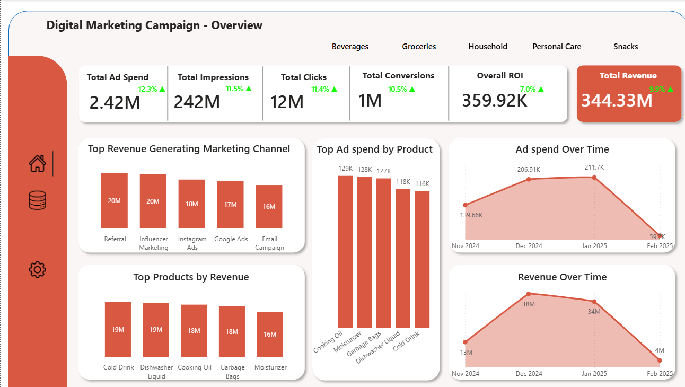
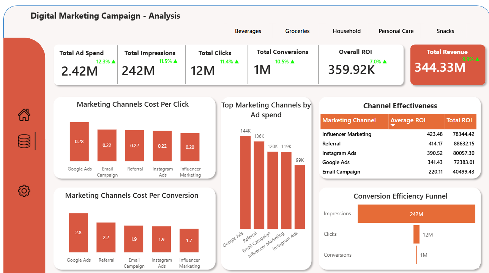

# Digital Marketing Campaign Analysis and Optimization

##  Project Overview
This project provides an in-depth analysis of **Digital Marketing Campaign Performance** across multiple channels and products, aimed at helping businesses **optimize ad spend, maximize conversions, and improve ROI**.

The analysis was conducted using **Excel for data cleaning** and **Power BI for modeling and visualization**, resulting in two interactive dashboards.  

**Time Frame:** November 2024 – February 2025 
**Key Metrics:** Ad Spend, Impressions, Clicks, Conversions, ROI, Revenue  
**Note:** CPC- Cost per Click, CPCv- Cost per Conversion

---

## Objectives
- Evaluate **overall marketing campaign performance**.  
- Compare **cost efficiency (CPC & CPCv)** across marketing channels.  
- Identify **top-performing products and channels**.  
- Detect **time-based trends** between ad spend and revenue.  
- Provide **actionable recommendations** for campaign optimization.  

---

## Methodology
1. **Data Cleaning & Transformation** – Conducted in Excel.  
2. **Data Modeling** – Built relationships across campaigns, products, and channels.  
3. **KPI Creation** – ROI, CPC, CPCv, and revenue calculations.  
4. **Visualization & Storytelling** – Designed Power BI dashboards for clarity and decision-making.  
5. **Segmentation** – Performance analyzed by **channel, product category, and time period**.  

---
## Dashboards

---
## Key Insights

### Overall Campaign Performance
- **Ad Spend:** $2.42M (+12.3%)  
- **Impressions:** 242M (+11.5%)  
- **Clicks:** 12M (+11.4%)  
- **Conversions:** 1M (+10.5%)  
- **Revenue:** $344.33M (+9.9%)  
- **ROI:** $359.92K (+7%)  

Revenue growth **outpaced ad spend growth**, showing improved efficiency.  

---

### Channel Performance
- **Lowest CPC:** Influencer Marketing ($0.20)  
- **Highest CPC:** Google Ads ($0.28)  
- **Lowest CPCv:** Influencer & Instagram Ads ($1.7)  
- **Highest CPCv:** Google Ads ($2.8)  
- **Top ROI Performer:** Influencer Marketing (423.48)  
- **Underperformer:** Email Campaign (low ROI despite significant spend)  

Despite high investment in **Google Ads**, its ROI lags compared to social and influencer-driven campaigns.  

---

### Product Performance
- **Top Revenue Products:** Cold Drink & Dishwasher Liquid ($19M each)  
- **High Ad Spend Products:** Cooking Oil ($129K), Moisturizer ($128K), Garbage Bags ($127K)  
- Some products show **over-investment vs. revenue returns**.  

---

### Time Trends
- **Ad Spend Peak:** Jan 2025 ($211.7K)  
- **Revenue Peak:** Dec 2024 ($38M)  
- **Feb 2025 Drop:** Ad spend fell sharply ($59.9K) → Revenue also dropped ($4M).  

Clear **correlation between ad spend and revenue**: consistent spending sustains higher revenue.  

---

### Conversion Funnel
- **Impressions:** 242M  
- **Clicks:** 12M  
- **Conversions:** 1M  
Significant drop-off from **clicks → conversions** highlights the need to improve **conversion funnels** (landing pages, retargeting, CTA optimization).  

---

## Recommendations
- **Reallocate Budgets:**  
  - Increase investment in **Influencer, Referral, and Instagram Ads**.  
  - Reduce spend on **Google Ads** unless targeting niche keywords.  

- **Optimize Campaigns:**  
  - Run **A/B testing** for Google Ads creative and targeting.  
  - Improve **Email Campaign strategy** to justify spend.  

- **Sustain Spending Levels:**  
  - Avoid drastic cuts in budget to prevent revenue decline.  
  - Implement **gradual adjustments** instead of sharp drops.  

- **Product Strategy:**  
  - Focus investment on **Cold Drink & Dishwasher Liquid** (high ROI products).  
  - Reassess **Moisturizer & Cooking Oil** (high spend, mid returns).  

- **Conversion Funnel Fix:**  
  - Improve **landing page UX**.  
  - Add **retargeting campaigns** to capture lost clicks.  

- **Leverage Seasonality:**  
  - Maximize promotions in **Dec–Jan**, where revenues historically peak.  

---

## Tools & Technologies
- **Excel** – Data cleaning & preprocessing  
- **Power BI** – Data modeling, KPI creation & visualization  

---

## Conclusion
This project demonstrates how **data-driven insights** can guide digital marketing teams to:  
- Optimize **channel investments**  
- Improve **conversion efficiency**  
- Maximize **ROI and revenue growth**  

By focusing on **high-performing channels, optimizing underperforming ones, and sustaining budget allocation**, businesses can achieve long-term digital marketing success.  

---
